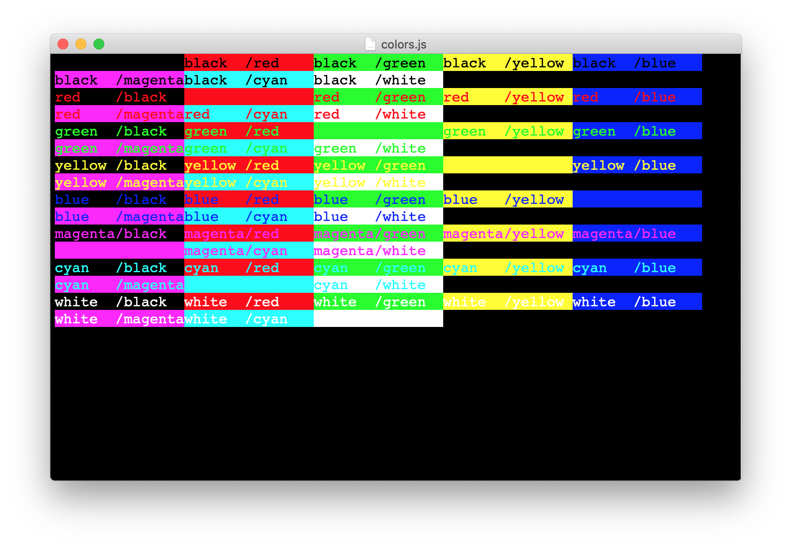
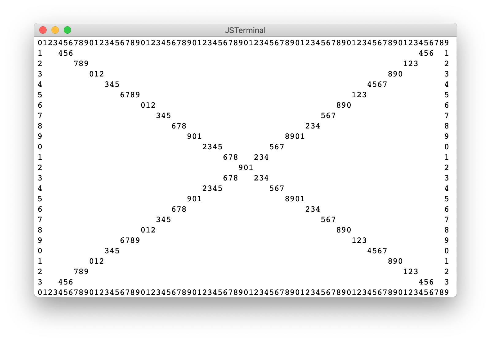
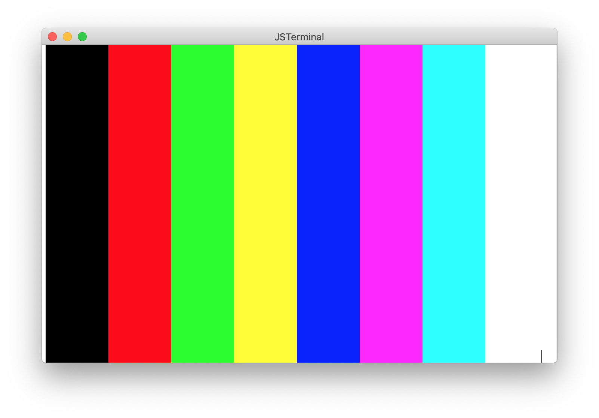
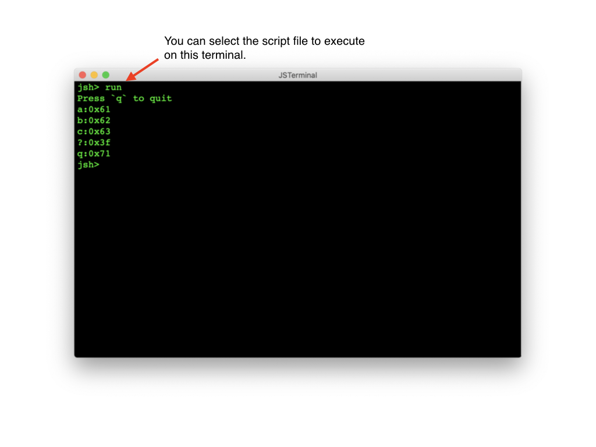

# Samples

## File control

## Terminal control
### Color
Display colored messages on terminal.
[EscapeCode class](https://github.com/steelwheels/KiwiScript/blob/master/KiwiLibrary/Document/Class/EscapeCode.md) is used to generate escape code for coloring.

#### Screen shot


#### Source code
````

function main(args)
{
	for(var fg=Color.min ; fg<=Color.max ; fg++){
		for(var bg=Color.min ; bg<=Color.max ; bg++){
			let fgstr  = EscapeCode.color(1, fg) ;
			let bgstr  = EscapeCode.color(0, bg) ;
			let fgname = colorName(fg) ;
			let bgname = colorName(bg) ;
			console.print(fgstr + bgstr + fgname + "/" + bgname) ;
		}
		console.print("\n") ;
	}
	console.print(EscapeCode.reset()) ;
}

function colorName(code)
{
	let result = "?" ;
	switch(code){
	  case 0:	result = "black  " ;	break ;
	  case 1:	result = "red    " ;	break ;
	  case 2:	result = "green  " ;	break ;
	  case 3:	result = "yellow " ;	break ;
	  case 4:	result = "blue   " ;	break ;
	  case 5:	result = "magenta" ;	break ;
	  case 6:	result = "cyan   " ;	break ;
	  case 7:	result = "white  " ;	break ;
	}
	return result ;
}

````

### Curses
The [Curses class](https://github.com/steelwheels/KiwiScript/blob/master/KiwiLibrary/Document/Class/Curses.md)
supports character based graphics on terminal.

#### Screen shot (1/2)


#### Source code (1/2)
````

function main()
{
	console.log("setup curses start\n") ;

	Curses.start() ;

	let width  = Curses.width ;
	let height = Curses.height ;

	/* Left: top -> bottom */
	for(i=0 ; i<height ; i++){
		Curses.moveTo(0, i) ;
		console.print(i % 10) ;
	}
	/* Right: top -> bottom */
	for(i=0 ; i<height ; i++){
		Curses.moveTo(width-1, i) ;
		console.print(i % 10) ;
	}

	/* Top: left -> right */
	for(i=0 ; i<width ; i++){
		Curses.moveTo(i, 0) ;
		console.print(i % 10) ;
	}
	/* Bottom: left -> right */
	for(i=0 ; i<width ; i++){
		Curses.moveTo(i, height-1) ;
		console.print(i % 10) ;
	}

	/* Cross */
	for(i=0 ; i<width ; i++){
		let y0 = Math.floor(i * height / width) ;
		Curses.moveTo(i, y0) ;
		console.print(i % 10) ;

		let y1 = height - 1 - y0 ;
		Curses.moveTo(i, y1) ;
		console.print(i % 10) ;
	}

	/* Wait any key is pressed */
	while(Curses.inkey() == null){
		sleep(0.1) ;
	}

	Curses.end() ;

	return 0 ;
}


````

### Screen shot (2/2)


#### Source code (2/2)
````

function main()
{
	Curses.start() ;

	const width  = Curses.width ;
	const height = Curses.height ;
	const colnum = Color.max - Color.min + 1;
	const diff   = width / colnum ;

	let   xpos  = 0 ;
	for(let col=Color.min ; col<=Color.max ; col++){
		Curses.foregroundColor = Color.white
		Curses.backgroundColor = col ;

		Curses.fill(xpos, 0, diff, height, " ") ;
		xpos += diff ;
	}

	while(Curses.inkey() == null){
		sleep(0.1) ;
	}

	Curses.end() ;

	return 0 ;
}


````

### Keycode

#### Screen shot
This is screen shot of `JSTerminal` application.
It contains how to execute the script and result of the execution.


#### Source code
````

function main(args)
{
	let c     = "?" ;
	let prevc = "-" ;
	stdout.put("Press `q` to quit\n") ;
	while(c != "q"){
		c = stdin.getc() ;
		if(c != null && c != prevc){
			let len = c.length ;
			for(let i=0 ; i<len ; i++){
				let code = c.charCodeAt(i) ;
				printCode(code) ;
			}
			prevc = c ;
		}
	}
	return 0 ;
}

function printCode(code)
{
	let name = asciiCodeName(code) ;
	if(name == null){
		name = "?" ;
	}
	let hexcode = "0x" + code.toString(16) ;
	stdout.put(name + ":" + hexcode + "\n") ;
}


````

## Related links
* [JSTerminal](https://github.com/steelwheels/JSTerminal): The terminal application to execute [jsh](https://github.com/steelwheels/JSTools/blob/master/Document/jsh-lang.md).
* [jsh](https://github.com/steelwheels/JSTools/blob/master/Document/jsh-man.md): Shell program.
